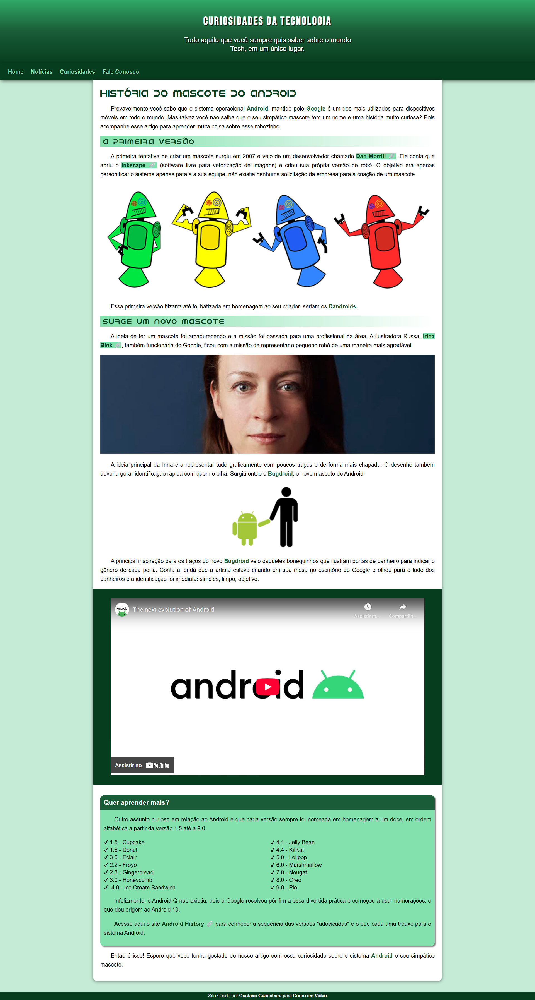

# 🤖 Projeto Android

---

Uma página web informativa sobre o sistema operacional Android, desenvolvida como parte dos estudos de HTML5 e CSS3 no Curso em Vídeo.

O conteúdo aborda curiosidades, história e detalhes sobre o mascote e o sistema Android, com layout limpo, legível e responsivo.

## 👀 Preview do Projeto

## 🌐 Acesse o Projeto

👉 [Clique aqui para acessar o site!](https://devsandrobatista.github.io/projeto-android/)

## 🎯 Objetivo do Projeto

**O projeto foi desenvolvido com foco em:**

- Consolidar conhecimentos de HTML5 semântico
- Trabalhar com CSS3 moderno
- Criar uma página informativa com conteúdo real sobre tecnologia
- Aplicar boas práticas de layout e estilo
- Construir uma estrutura responsiva que se adapta a diferentes telas

⚠️**Observações:** Este projeto é estático — não há backend ou lógica de programação além de links.

## 🛠️ Tecnologias Utilizadas

- HTML5
- CSS3
- Layout Responsivo
- Imagens e ícones com elemento de navegação
- Iframe

## 📂 Estrutura do Projeto

     projeto-android/
     ├── 📂 assets
     │ ├── 📂 css
     │ │ ├── 📄 reset.css
     │ │ └── 📄 style.css
     │ ├── 📁 fonts
     │ │ └── (fontes usadas no site)
     │ ├── 📁 images
     │ │ └── (várias imagens de logos e telas)
     │ └── 📁 text
     │   └── 📄 android-site-content.txt
     ├── 📄 .gitattributes
     ├── 📄 index.html
     ├── 📄 LICENSE
     └── README.md

## 🚀 Como Executar o Projeto

Não é necessário instalar nenhuma dependência.

**Passos:**

1.  Clone o repositório:

        git clone https://github.com/devsandrobatista/projeto-android.git

2.  Acesse a pasta do projeto:

         cd projeto-android

3.  Abra o arquivo index.html diretamente no navegador
    ou
    use uma extensão como Live Server no VS Code para melhor experiência.

## 🖥️ Uso / Funcionalidades

- Exibição de textos e imagens informativas sobre Android
- Navegação simples em uma página estática
- Layout responsivo para desktop e mobile

**Ideal para:**

- Estudos iniciais em Front-end
- Portfólio de projetos básicos
- Referência de estrutura HTML + CSS
- Página de contato ou perfil simples

## 📚 Créditos

Projeto desenvolvido com base no conteúdo educacional do [CursoemVídeo](https://www.youtube.com/@cursoemvideo)

**Professor:** [Gustavo Guanabara](https://github.com/gustavoguanabara)

**Curso:** [HTML5 e CSS3: modulo 2 de 5](https://www.cursoemvideo.com/curso/curso-html5-e-css3-modulo-4-de-5-40-horas/)

## 📄 Licença

Este projeto está sob a licença MIT.

Sinta-se livre para estudar, modificar e reutilizar.
